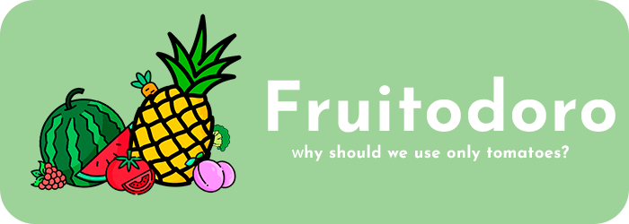

<div>
  
</div>

<div align='center'>
  <i>Fruitodoro - is a fun twist on the classic Pomodoro technique!
  </i>
</div>

## 🚀 Features

- **Fruit Selection**: Choose from a variety of fruits to replace the tomato.
- **Progress Tracking**: Keep track of your completed sessions.
- **Soundboard**: Enjoy built-in panel with relaxing sounds.
- **System tray**: App goes to tray on minimize.
- **Awesome UI**: Enjoy a cozy, light-themed interface.
- **Tauri App**: Lightweight and secure, built with [Tauri](https://tauri.app/). 

<br>

  **[📹DEMO](https://www.youtube.com/watch?v=Yfpj5IL1PTQ)**


## 💚 How to use?
1. **Install** the latest build or build on your own
2. **Open the bundle** and follow the steps of installation
3. **Enjoy** the app!

👨‍🌾 *You can use these different fruits as indiators of your school subject. 
You can mentally link a subject for example math to a watermelon.
Navigating to a inventory panel will show you have many 25 min math sessions 
have you done by showing how many watermelons you have.*

<br>

## ⭐️ Contributing

This project uses Tauri and Vue 3 with Vite. The codebase looks a bit overloaded
because I decided to not use state managers like Pinia to have more practice with Vue.
However, there are a lot of features that might be implemented, so I will be glad to
see any PRs.

If you want to add a **new fruit**, you can just create an object inside *src/assets/themes.json*
This object must contain proper css theme colors and img's name. The image itself must placed to the
*public/img* directory. Recompile and now you have a new fruit. \
\
*Hint: Explore how other fruits are created*

<br>

## 🛠️ Build

**Rust, tauri and npm must be installed ❗️**


1. **Clone the repository**
   
    ```bash
   git clone https://github.com/mmnvb/fruitodoro.git
    ```

2. **Inspect to project**

    ```bash
    cd fruitodoro
    ```

3. **Install npm dependencies**

     ```bash
     npm install
     ```

4. **Run the dev server**

   ```bash
   cargo tauri dev
   ```
   *Note: initial building process takes some time*

<div align="center">
  <hr>
  <i>© Bobomurod, 2024 ⭐️</i>
</div>
