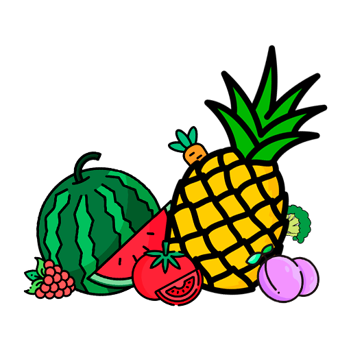
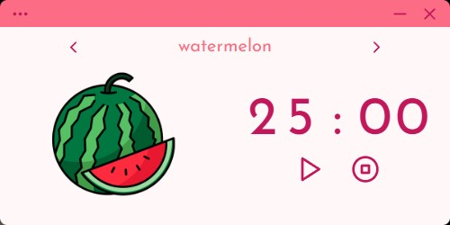
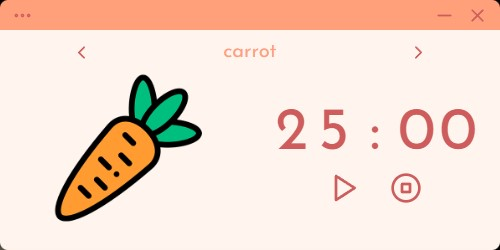
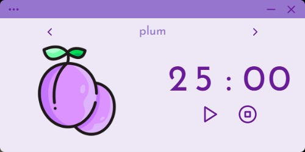
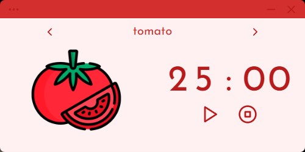
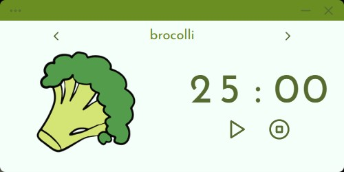
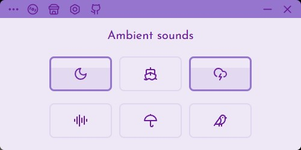
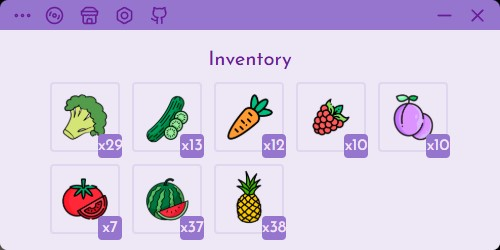

<div align="center">
  <a href="https://www.youtube.com/watch?v=Yfpj5IL1PTQ">
    
  </a>
</div>

<p align="center">
  Fruitodoro - a pomodoro timer on steroids.
  
</p>

<p align="center">
  <a href="https://www.youtube.com/watch?v=Yfpj5IL1PTQ">
    📹DEMO
  </a>
</p>

## Features
- pomodoro timer
- ambient sound soundboard
- system tray
- awesome themes
- cozy UI

<br>

## Installation
1. **Install** the latest [bundle](https://github.com/mmnvb/fruitodoro/releases) or build on your own
2. **Open the bundle** and follow the steps of installation
3. **Enjoy** the app!

👨‍🌾 *You can use different fruits as indiators of your school subject. 
You can mentally link a subject, for example math, to a watermelon.
Navigating to the inventory panel will show you have many 25 min math sessions 
have you done by showing how many watermelons you have.*

<br>

## Themes
<p align="center">
  
  
  
</p>
<p align="center">
  
  
</p>

<!-- <p align="center">
  
  
</p> -->

## Contributing
This project uses Tauri and Vue 3 and Pinia.

If you want to add a **new fruit**, you can just create an object inside *src/assets/themes.json*
This object must contain proper css theme colors and img's name. The image itself must be placed to the
*public/img* directory. Recompile and now you have a new fruit.

*Note: settings tab would have this ability in the future*


## Build

**Rust, tauri and node must be installed**


1. **Clone the repository**
   
    ```bash
   git clone https://github.com/mmnvb/fruitodoro.git
    ```

2. **Inspect to project**

    ```bash
    cd fruitodoro
    ```

3. **Install npm dependencies**

     ```bash
     npm install
     ```

4. **Run the dev server**

   ```bash
   cargo tauri dev
   ```
   *Note: initial building process takes some time*

<div align="center">
  <hr>
  <i>© Bobomurod, 2025</i>
</div>
